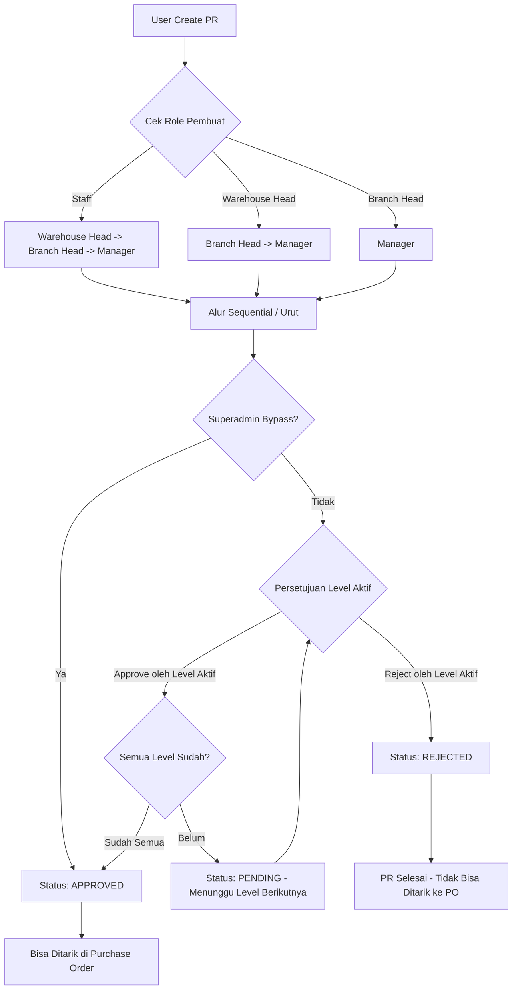

# Perencanaan Implementasi Modul Purchase Request (PR) Approval

Dokumen ini berisi spesifikasi teknis dan alur kerja (workflow) untuk diimplementasikan oleh Junior Programmer atau AI Model.

---

## 1. Stack Teknologi & Library
Modul ini akan dikembangkan pada sisi Frontend menggunakan:
*   **Framework/Build Tool**: React + Vite
*   **Routing**: TanStack Router (File-based routing)
*   **State & API Fetching**: TanStack Query (React Query) + Axios
*   **Form & Validation**: React Hook Form + Zod
*   **Styling & UI**: Tailwind CSS + Shadcn UI (Radix UI)
*   **API Base URL**: `http://localhost:3000` (Mengacu pada [api-list.md](file:///d:/_Code/vibe-coding/belajar-vibe-coding/documentation/api-list.md))

---

## 2. Diagram Workflow Approval (Mermaid)

Berikut adalah visualisasi alur persetujuan (approval flow) berdasarkan level yang dikonfigurasi:



---

## 3. Aturan & Tingkat Persetujuan (Approval Levels)

Aturan tingkatan persetujuan dikonfigurasi secara dinamis di halaman Pengaturan. Default alurnya adalah sebagai berikut:

| Role Pembuat (Requester) | Urutan Approver Wajib | Kondisi Akhir |
| :--- | :--- | :--- |
| **staff** | Warehouse Head $\rightarrow$ Branch Head $\rightarrow$ Manager | Status **Approved** jika ketiganya setuju |
| **warehouse_head** | Branch Head $\rightarrow$ Manager | Status **Approved** jika keduanya setuju |
| **branch_head** | Manager | Status **Approved** jika Manager setuju |

### Aturan Ketat (Constraints)
1.  **Sequential & No Skipping**: Persetujuan harus berurutan. Branch Head tidak bisa menyetujui jika Warehouse Head belum memberikan persetujuan (untuk requester Staff).
2.  **Superadmin Bypass**: Superadmin memiliki tombol khusus **"Bypass Approval"** untuk menyetujui PR secara instan tanpa mengikuti antrean persetujuan demi keperluan darurat.
3.  **Status PR**:
    *   **Draft**: Saat PR baru dibuat oleh pembuat dan belum diajukan.
    *   **Pending**: Saat proses approval sedang berjalan (baik menunggu level pertama maupun level selanjutnya).
    *   **Approved**: Hanya setelah seluruh rantai approval selesai atau di-bypass oleh Superadmin.
    *   **Rejected**: Jika salah satu level menolak (proses berhenti seketika).

---

## 4. Pemetaan Data Approval Berdasarkan Warehouse & Role (Data Mapping)

Untuk menghindari salah sasaran persetujuan, modul harus mengimplementasikan pemetaan data (scoping data) berdasarkan asal **Warehouse (Gudang)** dari Purchase Request tersebut:

1.  **Warehouse Head Level**:
    *   Jika PR diajukan untuk **Gudang 1**, maka tugas approval di level Warehouse Head **hanya** muncul dan bisa dieksekusi oleh user yang ditunjuk sebagai *Head/Kepala Gudang 1* (berdasarkan tabel relasi `warehouse_heads`).
    *   Kepala Gudang 2 tidak boleh melihat atau memproses approval PR dari Gudang 1.
2.  **Branch Head Level**:
    *   Persetujuan di level Branch Head juga disaring berdasarkan relasi cabang gudang tersebut. Hanya Branch Head dari wilayah/cabang Gudang 1 yang dapat menyetujui.
3.  **Manager Level**:
    *   Persetujuan tingkat tertinggi (Manager) bersifat **Global**. Hanya ada 1 Manager (atau role manager) secara terpusat yang memvalidasi seluruh PR dari semua cabang/gudang.

---

## 5. Integrasi API & Payload (http://localhost:3000)

### A. Endpoint Purchase Request
*   **List PR**: `GET /api/purchase-requests` (Filter status `Approved` untuk modul PO)
*   **Detail PR**: `GET /api/purchase-requests/:id`
*   **Create PR**: `POST /api/purchase-requests`
*   **Update PR**: `PUT /api/purchase-requests/:id`
*   **Update Status/Approval**: `PATCH /api/purchase-requests/:id/status`
    *   *Payload:*
        ```json
        {
          "status": 2, // 0=Draft, 1=Pending, 2=Approved, 3=Rejected
          "remark": "Approval dari Warehouse Head"
        }
        ```

### B. Activity Log Logging
Setiap aksi approval, rejection, atau bypass wajib mencatat log ke endpoint `/api/activity-logs` melalui aksi `logActivity`:
*   *Aksi:* `APPROVE_PR`, `REJECT_PR`, `BYPASS_PR`
*   *Contoh Deskripsi:* `"User [email] melakukan BYPASS Approval pada PR [code]"`

---

## 6. Rancangan Antarmuka (UI/UX) - Shadcn UI

### A. Indikator Progress Approval (Step-by-Step)
Tampilan visual di detail PR menggunakan komponen Steps/Timeline dari Shadcn untuk melacak status approval saat ini:
*   **Hijau/Checked**: Sudah disetujui oleh level tersebut.
*   **Biru/Loading**: Sedang menunggu persetujuan dari level tersebut.
*   **Abu-abu**: Menunggu giliran berikutnya.
*   **Merah**: Ditolak (Rejected) pada level tersebut.

### B. Halaman Monitoring Status PR (Reporting Dashboard)
Dashboard khusus yang menampilkan tabel monitoring seluruh data PR:
*   Kolom: ID PR, Tanggal, Pembuat, Tahap Approval Saat Ini (e.g. *Waiting for Branch Head*), Status Akhir.
*   Filter berdasarkan: Tanggal, Status (`Pending`, `Approved`, `Rejected`), dan Gudang/Warehouse.

### C. Halaman Pengaturan Alur Approval
Halaman konfigurasi role mana saja yang wajib menyetujui PR berdasarkan role pembuatnya (dapat ditambah/dikurangi levelnya secara dinamis).

---

## 7. Sisi Modul Purchase Order (PO)
Pada form pembuatan Purchase Order (PO), dropdown atau modal pemilihan data Purchase Request **HANYA** menampilkan data PR yang memiliki `status === 2` (**Approved**). Status `Draft`, `Pending`, `Rejected`, dan `Closed` harus diblokir atau disembunyikan.
