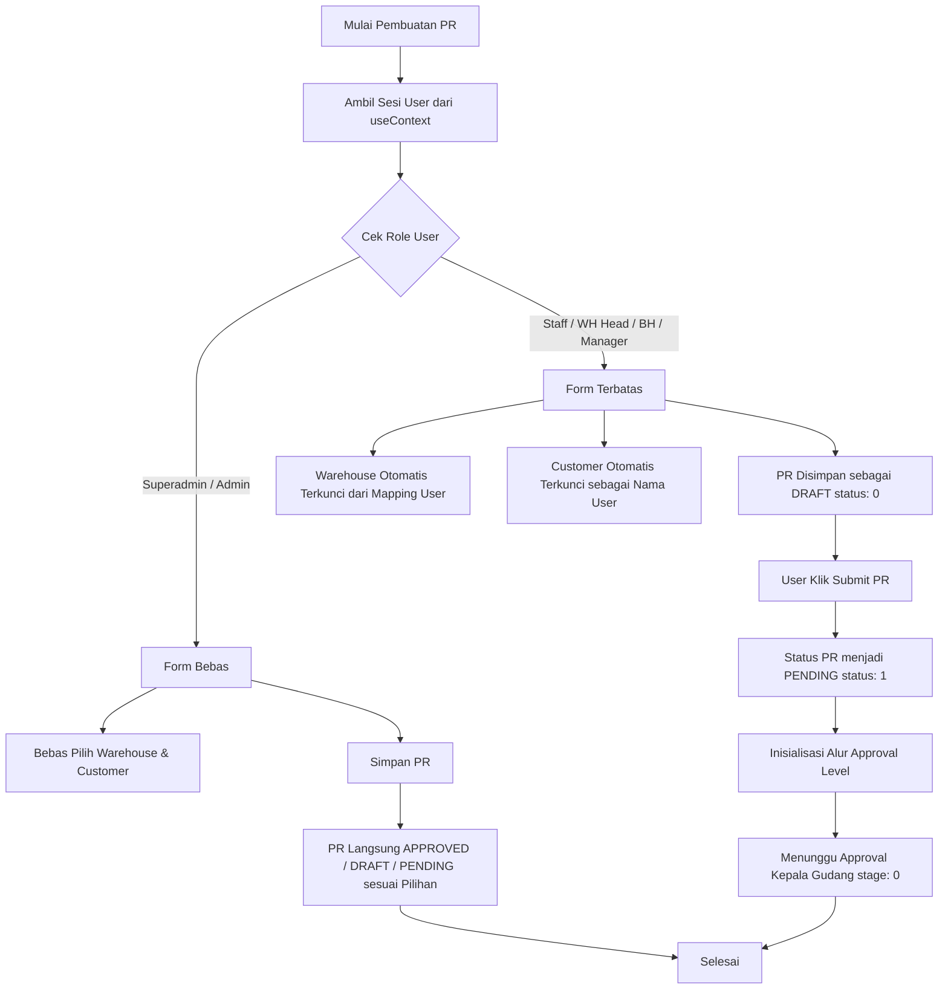
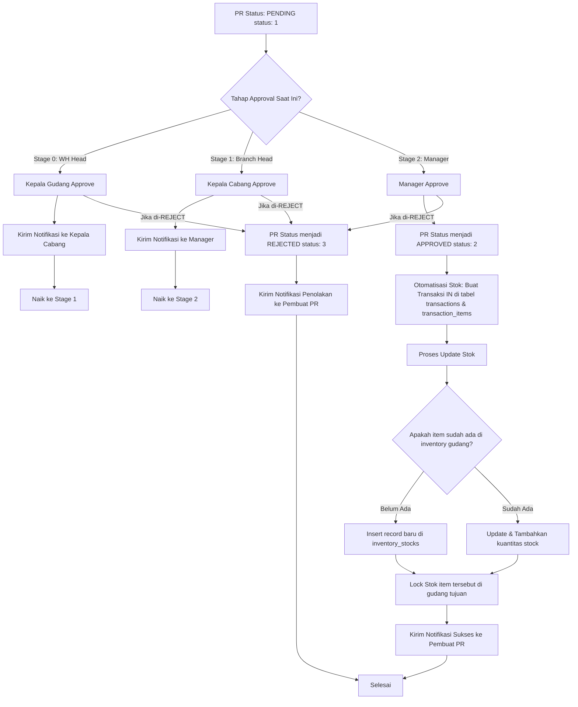
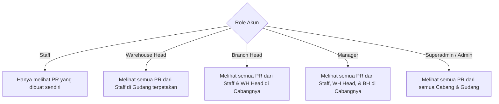

# Perencanaan Implementasi Purchase Request Berdasarkan Role

Dokumen ini berisi spesifikasi teknis, rancangan database/API, diagram alur kerja (workflow), dan detail implementasi antarmuka (UI) untuk fitur **Purchase Request (PR) Berdasarkan Role** serta **Audit Trail Mutasi Stok Menggunakan Struktur Database Transaksi Eksisting**. Dokumen ini ditujukan untuk diimplementasikan oleh Junior Programmer atau AI Model dengan biaya lebih murah.

---

## 1. Stack Teknologi & Base Environment

*   **Frontend**: React + Vite
*   **Routing**: TanStack Router
*   **State & API Fetching**: TanStack Query (React Query) & Axios untuk Hooks API (`useQuery`, `useMutation`).
*   **Styling & UI**: Tailwind CSS + Shadcn UI (Radix UI).
*   **Global State Management**: React Context API (`useContext`).
*   **Local API URL**: `http://localhost:3000` (Dokumentasi lengkap di [api-list.md](file:///d:/_Code/vibe-coding/belajar-vibe-coding/documentation/api-list.md)).

---

## 2. Diagram Alur Kerja (Workflow)

Berikut adalah visualisasi alur kerja berdasarkan persyaratan bisnis:

### A. Alur Pembuatan & Pengajuan PR berdasarkan Role

### B. Alur Persetujuan (Approval), Notifikasi, dan Otomatisasi Stok

### C. Visibilitas Data & Hak Akses PR (Visibility Matrix)

---

## 3. Detail Perencanaan Teknis & Fitur

### 1. Visibilitas Data Berdasarkan Role (Data Filtering di Backend)
Modifikasi backend `/api/purchase-requests` (GET `/`) agar memfilter data secara otomatis berdasarkan token pemanggil:
*   **Staff**: query database dengan filter `requestedBy = currentUser.id`.
*   **Warehouse Head**: query database dengan filter `warehouseId IN (daftar warehouseId aktif user di user_warehouse_mappings)`.
*   **Branch Head & Manager**: query database dengan filter `warehouseId IN (daftar warehouseId di bawah cabang yang bersangkutan)`.
*   **Superadmin & Admin**: tidak ada filter (tampilkan semua data).

### 2. Pembatasan Pengisian Form Pembuatan PR (Frontend)
Pada halaman form pembuatan PR baru:
*   Jika user memiliki role **Staff**:
    *   Dropdown "Warehouse/Gudang Tujuan" dinonaktifkan (`disabled`) dan otomatis terisi dengan warehouse dari mapping user.
    *   Dropdown/Input "Customer" dinonaktifkan (`disabled`) dan default ke nama/akun staff tersebut.
*   Jika user adalah **Superadmin / Admin**:
    *   Semua input (Warehouse, Customer, Pembuat) aktif dan bebas dipilih secara manual.
    *   Menyediakan opsi "Simpan sebagai Approved" secara langsung (Auto-Bypass Approval).

### 3. Kontrol CRUD (Create, Update, Delete) Berdasarkan Status
*   **Staff, WH Head, Branch Head, Manager**:
    *   Hanya bisa melakukan **Update** dan **Delete** jika status PR masih **Draft (0)**.
    *   Jika sudah berstatus **Pending (1)**, **Approved (2)**, atau **Rejected (3)**, tombol edit/delete wajib disembunyikan/dinonaktifkan di UI, dan backend harus menolak request tersebut.
*   **Superadmin & Admin**:
    *   Bisa melakukan **Create**, **Update**, dan **Delete** di setiap status (Draft, Pending, Approved, Rejected). Backend bypass validasi status untuk role ini.

### 4. Tampilan Monitoring Approval (UI Stepper)
Buat komponen visual (stepper) pada halaman detail PR untuk melacak progress approval:
*   **Daftar Stage**:
    1.  *Stage 0*: Kepala Gudang (Warehouse Head)
    2.  *Stage 1*: Kepala Cabang (Branch Head)
    3.  *Stage 2*: Manager
*   **Visual Status**:
    *   `Grey/Pending`: Belum sampai tahap ini.
    *   `Blue/Current`: Menunggu persetujuan (tampilkan nama user yang berwenang approve di stage ini untuk mempermudah follow-up).
    *   `Green/Approved`: Sudah disetujui (tampilkan nama approver & tanggal approve).
    *   `Red/Rejected`: Ditolak (tampilkan nama penolak & alasan/remark penolakan).

### 5. Otomatisasi Stok Eksisting & Penguncian (Locking)
Ketika PR disetujui oleh Manager (Approval Akhir):
*   Sistem mengubah status PR menjadi **Approved (2)**.
*   **Pencatatan Transaksi Otomatis (Inbound)**:
    *   Sistem secara programatis membuat record transaksi baru di tabel `transactions` dengan:
        *   `type`: `'IN'`
        *   `status`: `'COMPLETED'`
        *   `referenceNumber`: Kode PR (contoh: `'PR-20260706-0001'`)
        *   `description`: `"Otomatisasi Stok masuk dari Purchase Request: " + PR.code`
        *   `transactionDate`: `now()`
    *   Sistem memasukkan item-item dari PR ke tabel `transaction_items` yang terelasi ke record `transactions` tersebut.
*   **Otomatisasi Penambahan Stok**:
    *   Sistem mengecek apakah item terkait sudah memiliki record di tabel `inventory_stocks` untuk `warehouseId` (Gudang Tujuan) tersebut.
    *   **Jika BELUM ADA**: Sistem melakukan **insert baru** dengan `quantity` = kuantitas PR.
    *   **Jika SUDAH ADA**: Sistem melakukan **update/tambah kuantitas** (`quantity` baru = `quantity` lama + kuantitas PR).
*   **Audit Trail Mutasi**: Karena pencatatan stok masuk ini menghasilkan transaksi dengan status `COMPLETED` di tabel `transactions` & `transaction_items`, maka data ini dapat langsung diaudit tanpa memerlukan tabel mutasi tambahan.
*   **Locking (Penguncian Stok)**:
    *   Stock barang untuk item-item di PR pada gudang tujuan masuk dalam status **Locked (Terkunci)**.
    *   Non-superadmin tidak diperbolehkan melakukan penyesuaian stock (Stock Adjustment) atau menyelesaikan transaksi manual (Inbound/Outbound) yang memengaruhi item terkunci tersebut. Hanya user ber-role **Superadmin** yang dapat mengubah stok item tersebut.

---

## 4. Pemanfaatan Database Eksisting untuk Audit Trail

Monitoring keluar masuk barang tidak membutuhkan tabel baru, melainkan cukup memanfaatkan data transaksi eksisting dengan filter status `'COMPLETED'`:

1.  **Transaksi Masuk (Inbound)**: Didapat dari query tabel `transactions` joined `transaction_items` dengan kriteria `type = 'IN'` dan `status = 'COMPLETED'`. (Ini mencakup transaksi masuk manual dan transaksi masuk otomatis hasil PR yang di-approve).
2.  **Transaksi Keluar (Outbound)**: Didapat dari query tabel `transactions` joined `transaction_items` dengan kriteria `type = 'OUT'` dan `status = 'COMPLETED'`.

### Struktur Schema Eksisting yang Digunakan:
*   `transactions`: Menyimpan header transaksi (`id`, `warehouseId`, `type`, `referenceNumber`, `description`, `transactionDate`, `status`).
*   `transaction_items`: Menyimpan komponen item dan jumlah mutasi (`id`, `transactionId`, `itemId`, `quantity`).

---

## 5. Rencana Implementasi Langkah Demi Langkah (Step-by-Step)

### A. Sisi Backend & Database
1.  **Logika Penambahan Stok Otomatis saat PR Approved**:
    *   Pada file `purchase-request.model.ts` di bagian transaksional approval akhir (Manager):
        1.  Insert row baru ke tabel `transactions` dengan `type = 'IN'`, `status = 'COMPLETED'`, dan `referenceNumber = pr.code`.
        2.  Insert detail ke `transaction_items` untuk setiap item di PR.
        3.  Lakukan check-and-upsert pada `inventory_stocks` (jika data item per gudang belum ada, lakukan `insert`; jika sudah ada, lakukan `update` dengan penjumlahan kuantitas).
2.  **Modifikasi Validasi CRUD**:
    *   Pada model/controller `update` dan `delete`, izinkan bypass jika `role === 'superadmin'` atau `role === 'admin'`. Jika bukan, tolak update/delete jika `status !== 0` (Bukan Draft).
3.  **Implementasi Penguncian Stok**:
    *   Buat helper function `isStockLocked(warehouseId, itemId)` yang mengecek apakah ada Purchase Request berstatus **Approved (2)** yang memuat item tersebut di gudang terkait.
    *   Terapkan helper ini di controller transaksi/stok. Jika bernilai `true` dan user bukan Superadmin, kembalikan `403 Forbidden` ("Stok sedang dikunci oleh Purchase Request aktif").

### B. Sisi Frontend (Aplikasi Vite + React)
1.  **Global Context (`useContext`)**:
    *   Pastikan data user (termasuk role, ID, nama, dan daftar mapping warehouse) tersimpan secara global di `AuthContext`.
2.  **Modifikasi Halaman List Purchase Request**:
    *   Tambahkan komponen filter dropdown (filter berdasarkan status, warehouse).
    *   Tambahkan kolom input pencarian (berdasarkan Kode PR).
    *   Tambahkan fitur sorting (klik header tabel untuk mengganti `orderBy` Ascending/Descending).
    *   Integrasikan dengan pagination dari TanStack Query.
3.  **Tampilan Audit Trail Log Mutasi (Halaman Baru)**:
    *   Buat halaman laporan audit `/inventory/mutations` yang mengambil data dari API list transactions.
    *   API Backend yang dipanggil: `GET /api/transactions?status=COMPLETED` (bergantung pada list params query).
    *   Tabel menampilkan: Tanggal Transaksi, Kode Referensi (No. Transaksi / No. PR), Gudang, Tipe (IN/OUT), Nama Barang, dan Jumlah Barang.
    *   Menyediakan filter berdasarkan Gudang, Barang, dan Rentang Tanggal.

---

## 6. Rencana Pengujian & Verifikasi

### Pengujian Otomatis / Unit Testing (Backend)
*   **Test Case 1 (Otomatisasi Create Baru)**: Lakukan approval PR yang berisi item yang *belum pernah ada* di gudang tujuan. Pastikan data `inventory_stocks` baru terbentuk dan data transaksi `COMPLETED` baru tercatat di tabel `transactions`.
*   **Test Case 2 (Otomatisasi Update Existing)**: Lakukan approval PR untuk item yang *sudah ada* stoknya. Pastikan kuantitas bertambah dan record transaksi `COMPLETED` tercatat dengan benar.
*   **Test Case 3 (Audit Log Mutasi)**: Pastikan setiap transaksi masuk (Inbound) dan keluar (Outbound) menuliskan data audit yang tepat ke tabel `transactions` dengan status `COMPLETED`.
