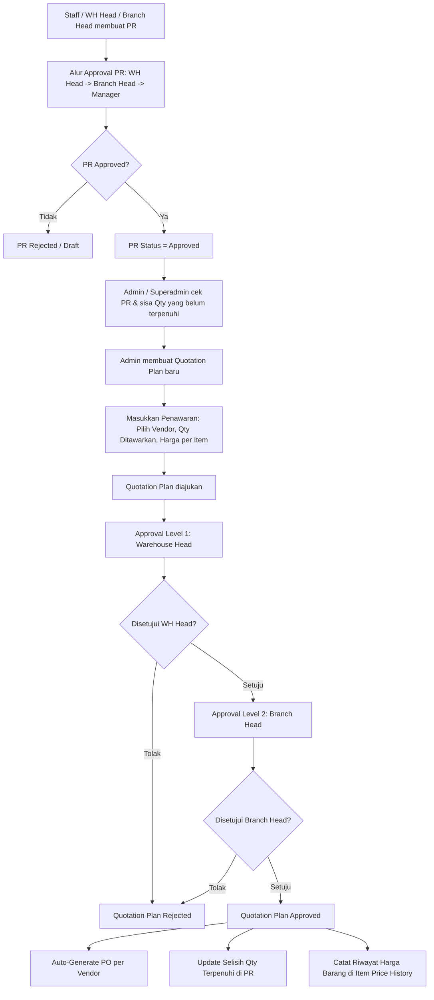

# Perencanaan Implementasi: Fitur Generate Quotation Plan dari Purchase Request ke Purchase Order

Dokumen ini berisi spesifikasi teknis dan perencanaan kerja untuk mengimplementasikan alur **Quotation Plan** dari item **Purchase Request (PR)** yang disetujui (*Approved*) untuk kemudian diteruskan menjadi **Purchase Order (PO)**.

---

## 1. Latar Belakang & Masalah
Saat ini, setelah Purchase Request (PR) disetujui, admin membuat Purchase Order (PO) secara langsung. Namun terdapat kendala:
1. **Keterbatasan Vendor**: Vendor tidak selalu dapat memenuhi seluruh kuantitas barang yang diminta di PR.
2. **Multi-Vendor**: Barang-barang di dalam satu PR seringkali perlu dipesan dari beberapa vendor berbeda.
3. **Fluktuasi Harga**: Harga barang dari vendor berubah-ubah sewaktu-waktu, sehingga menyulitkan penghitungan Harga Pokok Penjualan (HPP) / *Cost of Goods Sold* (COGS) secara transparan.

Diperlukan perantara berupa **Quotation Plan (Rencana Penawaran)** yang dikelola oleh Admin/Superadmin sebelum masuk ke tahap PO.

---

## 2. Alur Kerja (Workflow) & Logika Bisnis



### Detil Langkah Workflow:
1. **Pengajuan & Approval PR**: PR diajukan dan disetujui sampai tahap akhir (status = 2 / Approved).
2. **Pembuatan Quotation Plan (QP) oleh Admin/Superadmin**:
   - Dapat diakses dari detail PR yang berstatus *Approved* jika terdapat item yang kuantitasnya belum sepenuhnya terpenuhi.
   - Admin menentukan vendor untuk masing-masing item, kuantitas yang ditawarkan (`offeredQuantity`), dan harga penawaran. Kuantitas yang diajukan tidak boleh melebihi sisa kuantitas PR yang belum terpenuhi.
3. **Persetujuan Quotation Plan**:
   - QP yang diajukan akan masuk ke alur approval: **Warehouse Head** -> **Branch Head**.
   - *Tanpa perlu approval Manager* (karena Manager sudah menyetujui anggaran PR di awal).
   - Approval ini berfungsi untuk mengonfirmasi apakah gudang/cabang setuju memproses sisa barang sebagai *multi-PO* (partial) atau memilih menunggu hingga vendor mampu menyanggupi semua barang.
4. **Eksekusi Setelah QP Approved**:
   - **Auto-Generate PO**: Detail QP dikelompokkan berdasarkan `vendorId`. Untuk setiap vendor unik, sistem otomatis membuat draf/dokumen `PurchaseOrder` baru.
   - **Pencatatan Selisih Qty**: Kolom `processed_quantity` pada detail PR akan bertambah sejumlah `offeredQuantity`. Jika semua item PR sudah terpenuhi (processed == requested), status PR akan otomatis di-update menjadi selesai (Completed).
   - **Pencatatan Riwayat Harga**: Menyimpan harga penawaran saat ini ke tabel `item_price_histories` sebagai data historis HPP per item per vendor.

---

## 3. Database Schema

### A. Tabel Baru: `quotation_plans`
Menyimpan header data rencana penawaran.

| Nama Kolom | Tipe Data | Keterangan |
| :--- | :--- | :--- |
| `id` | UUID | Primary Key, default random |
| `purchase_request_id` | UUID | Foreign Key ke `purchase_requests.id` |
| `code` | VARCHAR(50) | Kode unik (contoh: `QP-20260708-0001`) |
| `status` | INTEGER | `0` = Draft, `1` = Pending WH Head, `2` = Pending Branch Head, `3` = Approved, `4` = Rejected |
| `current_approval_stage`| INTEGER | `0` = WH_HEAD, `1` = BRANCH_HEAD |
| `description` | TEXT | Catatan tambahan |
| `created_at` | TIMESTAMP | Waktu pembuatan |
| `updated_at` | TIMESTAMP | Waktu pembaruan |
| `deleted_at` | TIMESTAMP | Soft delete timestamp |
| `created_by` | UUID | Foreign Key ke `users.id` |
| `updated_by` | UUID | Foreign Key ke `users.id` |

### B. Tabel Baru: `quotation_plan_details`
Menyimpan item-item penawaran dari vendor.

| Nama Kolom | Tipe Data | Keterangan |
| :--- | :--- | :--- |
| `id` | UUID | Primary Key, default random |
| `quotation_plan_id` | UUID | Foreign Key ke `quotation_plans.id` |
| `item_id` | UUID | Foreign Key ke `items.id` |
| `vendor_id` | UUID | Foreign Key ke `vendors.id` |
| `requested_quantity` | INTEGER | Jumlah yang diminta di PR asal |
| `offered_quantity` | INTEGER | Jumlah yang bisa dipenuhi oleh vendor saat ini |
| `price` | DECIMAL(18,2)| Harga penawaran per unit dari vendor |
| `total_price` | DECIMAL(18,2)| `offered_quantity` * `price` |
| `remark` | TEXT | Catatan khusus per item |
| `attachment_url` | VARCHAR(500) | Link attachment bukti/spek dari vendor |
| `created_at` | TIMESTAMP | Waktu pembuatan |
| `updated_at` | TIMESTAMP | Waktu pembaruan |
| `deleted_at` | TIMESTAMP | Soft delete timestamp |

### C. Tabel Baru: `quotation_plan_approvals`
Menyimpan log alur persetujuan Quotation Plan.

| Nama Kolom | Tipe Data | Keterangan |
| :--- | :--- | :--- |
| `id` | UUID | Primary Key |
| `quotation_plan_id` | UUID | Foreign Key ke `quotation_plans.id` |
| `stage` | INTEGER | `0` = WH_HEAD, `1` = BRANCH_HEAD |
| `approver_id` | UUID | Foreign Key ke `users.id` (ditentukan saat QP diajukan sesuai pemetaan gudang) |
| `status` | INTEGER | `0` = Pending, `1` = Approved, `2` = Rejected |
| `notes` | TEXT | Alasan persetujuan / penolakan |
| `created_at` | TIMESTAMP | Waktu pembuatan |
| `updated_at` | TIMESTAMP | Waktu pembaruan |

### D. Tabel Baru: `item_price_histories`
Melacak riwayat harga barang per vendor untuk pelaporan HPP (COGS).

| Nama Kolom | Tipe Data | Keterangan |
| :--- | :--- | :--- |
| `id` | UUID | Primary Key |
| `item_id` | UUID | Foreign Key ke `items.id` |
| `vendor_id` | UUID | Foreign Key ke `vendors.id` |
| `price` | DECIMAL(18,2)| Harga penawaran yang disetujui |
| `source_type` | VARCHAR(50) | Asal usul harga (e.g., `'QUOTATION'`, `'PO'`) |
| `source_id` | UUID | ID referensi dokumen asal (`quotation_plan_details.id` atau `purchase_order_details.id`) |
| `effective_date` | DATE | Tanggal berlakunya harga |
| `created_at` | TIMESTAMP | Waktu pembuatan |

### E. Modifikasi Tabel Eksisting: `purchase_request_details`
Tambahkan kolom untuk melacak jumlah yang sudah diproses agar dapat menghitung selisihnya.

```sql
ALTER TABLE purchase_request_details ADD COLUMN processed_quantity INTEGER NOT NULL DEFAULT 0;
```

---

## 4. Spesifikasi Peran & Otoritas (Role & Access Control)

### A. Hak Akses Quotation Plan
- **Admin & Superadmin**: Dapat membuat, memperbarui, dan menghapus (draft) Quotation Plan.
- **Warehouse Head & Branch Head**: Hanya dapat melihat dan melakukan approval/reject pada Quotation Plan sesuai wilayah otoritasnya.
- **Staff**: Tidak dapat mengakses/melihat modul Quotation Plan.
- **Manager**: Hanya dapat melihat data quotation plan saja.

### B. Visibilitas Data Purchase Request (Sesuai Role)
Setiap user hanya dapat melihat data PR sesuai tingkatan otoritasnya:
1. **Staff**: Hanya PR yang dibuat oleh dirinya sendiri (`createdBy = userId`).
2. **Warehouse Head**: Semua PR yang ditujukan ke gudang yang dikepalainya (`warehouseId` sesuai pemetaan `user_warehouse_mappings`).
3. **Branch Head**: Semua PR dari seluruh gudang yang berada di dalam cabang yang dipimpinnya (`branchId` dari gudang sesuai pemetaan).
4. **Manager**: Semua PR di cabang tempat ia bertugas.
5. **Superadmin**: Seluruh data PR di semua cabang/gudang tanpa filter.

---

## 5. Implementasi Backend (Running http://localhost:3000)

### API Endpoints Baru yang Diperlukan:
1. **Quotation Plan Headers**:
   - `POST /api/quotation-plans` (Create QP - Admin/Superadmin)
   - `GET /api/quotation-plans` (List QP dengan Pagination, Filtering `status` & `purchaseRequestId`, Sorting, Searching `code`)
   - `GET /api/quotation-plans/:id` (Get Detail QP)
   - `PUT /api/quotation-plans/:id` (Update QP - Admin/Superadmin)
   - `DELETE /api/quotation-plans/:id` (Delete QP - Admin/Superadmin)
2. **Quotation Plan Approvals**:
   - `POST /api/quotation-plans/:id/approve` (Approve QP - WH Head / Branch Head)
   - `POST /api/quotation-plans/:id/reject` (Reject QP - WH Head / Branch Head)
3. **Reporting HPP (Price History)**:
   - `GET /api/reports/price-history` (List riwayat harga per item/vendor untuk kebutuhan analisa HPP)

### Pengamanan Endpoint (Role & Action Validation):
Pastikan menggunakan middleware hak akses yang tepat. Aksi `CREATE/UPDATE/DELETE` pada quotation plan harus diamankan dengan memverifikasi role user (`admin` atau `superadmin`).

### Activity Logs Integration:
Setiap aksi CRUD dan Approval Quotation Plan wajib mencatat log aktivitas ke dalam tabel log aktivitas yang sudah ada:
```ts
await logActivity({
  userId: ctx.user.sub,
  action: "APPROVE_QUOTATION_PLAN",
  module: "QUOTATION",
  description: `User ${ctx.user.email} menyetujui Quotation Plan "${qp.code}"`,
});
```

---

## 6. Implementasi Frontend (Vite + TailwindCSS + Shadcn UI)

### A. State Management Global
- Gunakan **React Context** (`useContext`) untuk menyimpan state global seperti data user login, token, dan data warehouse/branch yang sedang diakses.

### B. Kueri & Mutasi API
- Gunakan `@tanstack/react-query` (`useQuery` & `useMutation`) untuk memanggil API.
- Terapkan mekanisme cache invalidation yang tepat (misalnya: saat QP berhasil disetujui, pemicu *invalidateQueries* untuk list PR dan QP agar data langsung sinkron).

### C. Komponen UI Utama:
1. **PR Detail Page (Update)**:
   - Jika PR berstatus *Approved* dan ada item dengan `processed_quantity < quantity`, tampilkan tombol **"Buat Rencana Penawaran (Quotation Plan)"** (Hanya untuk Admin/Superadmin).
   - Tampilkan tabel detail PR yang kini memiliki kolom tambahan: **Qty Diminta**, **Qty Diproses**, dan **Sisa Qty (Selisih)**.
2. **Create/Edit Quotation Plan Form**:
   - Form multi-step atau tabular yang memuat daftar item PR yang belum terpenuhi.
   - Pilihan dropdown pencarian Vendor untuk tiap item (`SearchableSelect`).
   - Input kuantitas penawaran (`offered_quantity`) dengan validasi maksimal = sisa kuantitas PR yang belum dipesan.
   - Input harga penawaran (`price`) serta kolom catatan (`remark`) & tautan berkas (`attachmentUrl`).
3. **Quotation Plan Approval Panel**:
   - Halaman khusus bagi WH Head / Branch Head untuk meninjau penawaran.
   - Menampilkan ringkasan: *"Barang ini akan dibagi menjadi X Purchase Order ke X Vendor berbeda"* jika admin memilih multi-vendor.
   - Stepper penanda alur persetujuan (Warehouse Head -> Branch Head).
4. **HPP Report Page**:
   - Halaman chart / table untuk melacak tren perubahan harga penawaran per item per vendor menggunakan data dari API `/api/reports/price-history`.

---

## 7. Rencana Pengujian (Verification Plan)

### A. Skenario Pengujian Fungsional
1. **Validasi Kuantitas Penawaran**: Coba buat Quotation Plan dengan `offered_quantity` melebihi sisa kebutuhan PR. Sistem harus menolak dengan pesan error.
2. **Pecah Vendor (Multi-PO)**: Buat Quotation Plan berisi 3 item dengan 2 item mengarah ke Vendor A dan 1 item ke Vendor B. Setelah status disetujui, verifikasi bahwa terbentuk 2 PO baru secara otomatis.
3. **Pencatatan Selisih Qty**: Setelah QP disetujui, buka detail PR asal dan pastikan kolom `Qty Diproses` bertambah serta `Sisa Qty` berkurang secara tepat.
4. **Audit Log & Price History**: Pastikan log aktivitas tercatat dengan jelas, dan tabel `item_price_histories` mendapat baris baru berisi harga dan vendor dari QP bersangkutan.

### B. Validasi Role-Based Access Control
1. Gunakan akun bertipe **Staff** dan pastikan menu Quotation Plan tidak dapat diakses baik melalui UI maupun hit API langsung.
2. Gunakan akun bertipe **Warehouse Head** untuk menyetujui QP level 1. Pastikan status QP berubah menjadi "Pending Branch Head" (stage 1) dan log activity mencatat nama WH Head tersebut.
