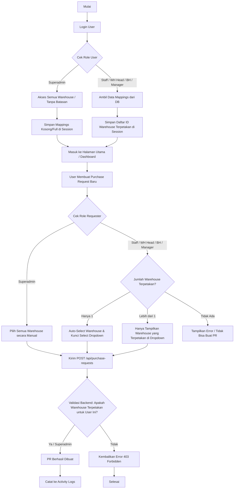
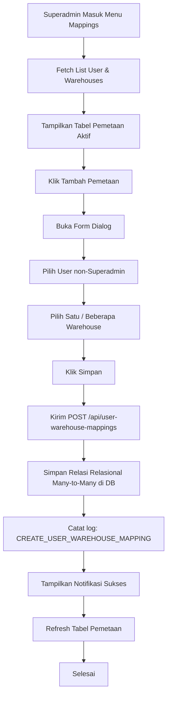

# Perencanaan Implementasi Modul User Mapping Warehouse

Dokumen ini berisi spesifikasi teknis, rancangan database, integrasi API, dan alur kerja (workflow) untuk diimplementasikan oleh Junior Programmer atau AI Model pada Modul **User Mapping Warehouse** (Pemetaan User ke Gudang).

---

## 1. Stack Teknologi & Library

Sisi Frontend wajib menggunakan:
*   **Framework/Build Tool**: React + Vite
*   **Routing**: TanStack Router (File-based routing)
*   **State & API Fetching**: TanStack Query (React Query) + Axios
*   **Form & Validation**: React Hook Form + Zod
*   **Styling & UI**: Tailwind CSS + Shadcn UI (Radix UI)
*   **API Base URL**: `http://localhost:3000` (Mengacu pada [api-list.md](file:///d:/_Code/vibe-coding/belajar-vibe-coding/documentation/api-list.md))

---

## 2. Diagram Alur Kerja (Workflow)

Visualisasi alur pemetaan gudang user dan validasinya saat pembuatan Purchase Request (PR):



### B. Diagram Pengaturan Pemetaan oleh Admin (Admin Mapping Flow)

Berikut adalah alur bagaimana Superadmin mengelola pemetaan warehouse untuk masing-masing user melalui panel pengaturan:



---

## 3. Struktur Database (Schema)

Buat tabel baru `user_warehouse_mappings` di backend menggunakan Drizzle ORM:

```typescript
export const userWarehouseMappings = pgTable(
  "user_warehouse_mappings",
  {
    id: uuid("id").primaryKey().defaultRandom(),
    userId: uuid("user_id")
      .notNull()
      .references(() => users.id, { onDelete: "cascade" }),
    warehouseId: uuid("warehouse_id")
      .notNull()
      .references(() => warehouses.id, { onDelete: "cascade" }),
    isActive: boolean("is_active").notNull().default(true),
    ...auditColumns,
  },
  (t) => [
    index("idx_uwm_user_id").on(t.userId),
    index("idx_uwm_warehouse_id").on(t.warehouseId),
    uniqueIndex("uq_user_warehouse").on(t.userId, t.warehouseId),
  ]
);
```

---

## 4. Integrasi Sesi Login & API (http://localhost:3000)

### A. Autentikasi (`/api/auth/login` & `/api/auth/me`)
Modifikasi respons API auth agar melampirkan data warehouse yang terpetakan untuk user:
*   Jika user adalah `superadmin`, kembalikan seluruh daftar warehouse aktif.
*   Jika user memiliki role lainnya (`staff`, `warehouse_head`, `branch_head`, `manager`), ambil data dari tabel `user_warehouse_mappings` (yang statusnya `isActive: true`).
*   Format respons payload:
    ```json
    {
      "meta": { "status": true, "code": 200, "message": "Success" },
      "data": {
        "record": {
          "id": "user-uuid",
          "name": "Jane Doe",
          "email": "jane@example.com",
          "role": "staff",
          "mappedWarehouses": [
            {
              "id": "warehouse-uuid-1",
              "code": "GDG_JKT_01",
              "name": "Gudang Jakarta Pusat"
            }
          ]
        }
      }
    }
    ```

### B. Endpoint Baru Mapping
*   **List Mappings**: `GET /api/user-warehouse-mappings` (Mendukung filter `userId` dan pagination)
*   **Create Mapping**: `POST /api/user-warehouse-mappings`
    *   *Payload:*
        ```json
        {
          "userId": "user-uuid",
          "warehouseIds": ["warehouse-uuid-1", "warehouse-uuid-2"]
        }
        ```
*   **Delete Mapping**: `DELETE /api/user-warehouse-mappings/:id`

### C. Activity Logs
Setiap kali admin mengubah pemetaan gudang user, catat aktivitas ke endpoint `/api/activity-logs`:
*   *Action:* `CREATE_USER_WAREHOUSE_MAPPING` atau `DELETE_USER_WAREHOUSE_MAPPING`
*   *Description:* `"Admin [email] memetakan User [target_email] ke Warehouse [warehouse_name]"`

---

## 5. Validasi Sisi Server (Backend Validation)

Tambahkan middleware atau validasi model pada proses pembuatan/pembaruan Purchase Request (`POST /api/purchase-requests` dan `PUT /api/purchase-requests/:id`):
1.  Ambil `warehouseId` dari request body dan `userId` dari token sesi yang aktif.
2.  Periksa role user yang aktif. Jika role adalah `superadmin`, loloskan validasi.
3.  Jika role adalah `staff`, `warehouse_head`, `branch_head`, atau `manager`:
    *   Query tabel `user_warehouse_mappings` dengan kondisi `userId` and `warehouseId`.
    *   Jika data tidak ditemukan atau `isActive` bernilai `false`, gagalkan request dengan respons **HTTP 403 Forbidden**:
        ```json
        {
          "meta": {
            "status": false,
            "code": 403,
            "message": "Akses Ditolak!",
            "exceptionMessage": "Anda tidak memiliki akses ke gudang yang dipilih."
          },
          "data": null
        }
        ```

---

## 6. Sisi Frontend & Antarmuka (UI/UX)

### A. Penyimpanan State Sesi (`AuthContext.tsx`)
*   Perbarui interface `AuthUser` untuk menampung properti `mappedWarehouses`.
*   Gunakan data ini untuk membatasi opsi warehouse pada seluruh aplikasi frontend.

### B. Halaman Pengaturan Pemetaan (Admin Panel)
*   Buat route baru `/settings/user-warehouse-mappings`.
*   Tampilkan daftar user dengan pencarian dan filter.
*   Gunakan dialog form (Shadcn UI) dengan:
    *   Select input untuk memilih User (disaring hanya menampilkan non-superadmin).
    *   Checkbox group / Multi-select untuk memilih Warehouse yang akan dipetakan.

### C. Form Pengisian Purchase Request
*   Pada form pembuatan/pengeditan PR, periksa `user.mappedWarehouses`:
    *   **Jika hanya ada 1 warehouse**: Kolom select Warehouse langsung terisi otomatis (*auto-select*) dan dinonaktifkan (*disabled* / dikunci) agar staff tidak salah memasukkan gudang asal.
    *   **Jika ada lebih dari 1 warehouse**: Dropdown opsi Warehouse hanya menampilkan daftar gudang yang ada di `user.mappedWarehouses`.
    *   **Jika user adalah Superadmin**: Tampilkan seluruh pilihan gudang aktif tanpa batasan.
